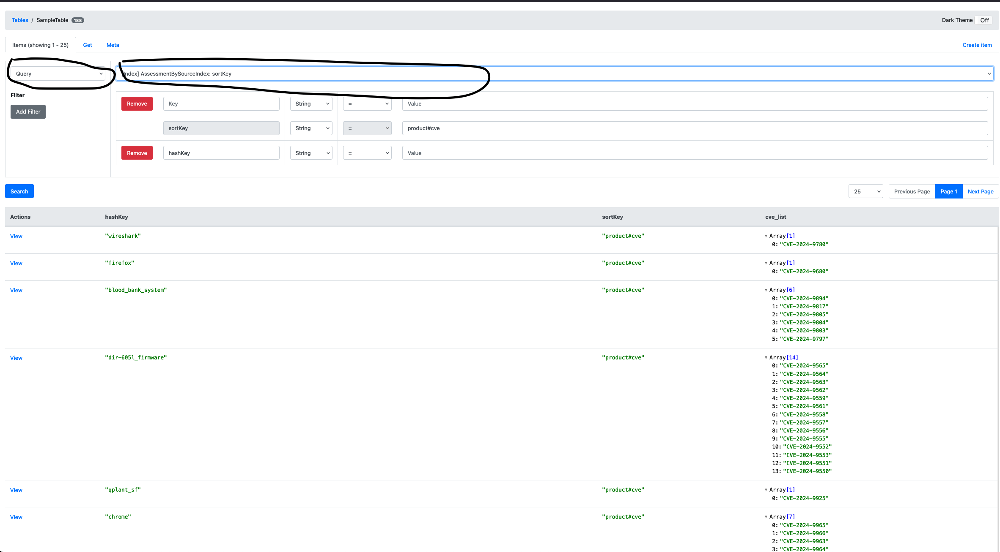

# HCSB Project

Welcome to the HCSB Project!

## Prerequisites

Before you get started, ensure you have the following prerequisites installed:

- [Python 3](https://www.python.org/downloads/)
- [virtualenv](https://pypi.org/project/virtualenv/)
- [Git](https://git-scm.com/)
- [node/Npm](https://docs.npmjs.com/downloading-and-installing-node-js-and-npm)
s
## Getting Started

Follow these step-by-step instructions to set up and run the project:

### 1. Create a Parent Directory

```bash
mkdir hcsb_project
cd hcsb_project
```

### 2. Create Virtualn Env
```bash
pip install virtualenv
python3 -m venv env
source env/bin/activate
```

### 3. Clone Repository

```bash
git clone <repoURL>
cd HCSB2020
pip3 install -r requirements.txt
```

### 4. Install Node/npm for Dynamodb GUI
This is for everyone who doesn't have node/npm package. Inorder to check if you have it or not, run `node -v` and if it shows the version number you have it and you're good. If you see sth else, you need to follow this step

- Install nvm package using `brew`
```bash
brew install nvm
```
- After that, you need to put these lines of code into your terminal profile 
(either `vim ~/.zshrc` or `vim ~/.bash_profile`):
```bash
export NVM_DIR="$HOME/.nvm"
  [ -s "/opt/homebrew/opt/nvm/nvm.sh" ] && \. "/opt/homebrew/opt/nvm/nvm.sh"  # This loads nvm
  [ -s "/opt/homebrew/opt/nvm/etc/bash_completion.d/nvm" ] && \. "/opt/homebrew/opt/nvm/etc/bash_completion.d/nvm"  # This loads nvm bash_completion
```
- After that restart your terminal and on an a new terminal, run these commands:
```bash
nvm install 10.3.0
npm install -g yarn
```

### 5. Build Dynamodb server
Open another terminal and run the following command to set up the DynamoDB locally:

```bash
make dynamodb-local
```
This is to setup the dynamodb server locally if you want to load the data locally and play with it.


- On another terminal, setup dynamodb GUI:
```bash
npm install -g dynamodb-admin #this pulls dynamodb-admin for the GUI
make dynamodb-admin
```
This sets up the dynamodb GUI for you to play with the data. Once you run this command, you will see a link in the terminal (NOTE: use the alternate link, not the first one----[http://0.0.0.0:8001](http://0.0.0.0:8001)), click on it and you will be able to see the GUI.

- Once you run ***Step 6***, you can refresh the page and you will see the tables that are created in the dynamodb. You can click on the table and see the data that is loaded in the table. You can play with data by doing multiple queries and see how the data is stored in the dynamodb.

For example, for _Sample Table_, pick Query option (you can find it  on the top left corner of the table) and Index on AssessmentBySourceIndex: sortkey option and put "product#cve" value for the sortKey. This will show you all the data stored with sortKey as "product#cve"--shows you list of all products stored and list of vulnerabilities that each products have. If you want to query for a specific row then you should change on what you're indexing on and query by the Hash Key



For the Sample Table, the list of sortKeys are as follows:
- _product#cve_
- _cve#details_
- _cve#epss_


### 6. Data ingestion
Run the command to collect data and store it in a JSON file:

```bash
make collect-data ACTION=$ACTION CONFIG=$CONFIG
```
- The CONFIG argument should either be __development__ (if you want to deploy your data to your AWS account) or __test__ (load your data to your local S3 and Dynamodb).

- The ACTION argument should pertain to the "action" that is specified in src/main.py is executed. For example, currently src/main.py is configured as follows:
```python
if __name__ == "__main__":
    options = {
        "vuln": {
            "function": generate.insert_vulnerability_data
        }
    }
    func_name = os.environ.get("ACTION", "")
    job = options.get(func_name, {}).get("function", None)
    if job is None:
        print(f"No job found for function key: {func_name}")
    else:
        job()
```
Specifying "make test-action ACTION=vuln CONFIG=test" will execute the **insert_vulnerability_data** function and load the data to your local S3 and Dynamodb.


### 7. Run API queries
Run the command to start the S3 bucket locally:
```bash
make s3-local
```
Here you have to put the name of the directory, username and password to setup the S3 bucket locally.
When you run this command, you will see multiple links in the terminal, click one of the links listed under the **WebUI** section so you can see the GUI and play with the data. 
  - __**NOTE**: If the first link you click doesn't work, then try the second one. Sometimes the first link doesn't work for some reason.__

### 8. Run the S3 bucket locally
Run the command to start the graphql and play with the queries:
```bash
make graphql
```
src/api/schemas folder contains the schema and the schema is segregated basically in accordance with the type of data you want to see.

- List of all the APIs that you can run (You can find them in the src/api/schemas/schema.graphql file):
  - ***listProducts***: Lists all the products stored in the dynamodb with each product having a list of vulnerabilities.
  - ***listCVEDetails***: Lists all the vulnerabilities stored in the dynamodb with each vulnerability showing their CVE details.
  - ***listEPSS***: Lists all the vulnerabilities stored in the dynamodb with each vulnerability showing their EPSS details.

  
